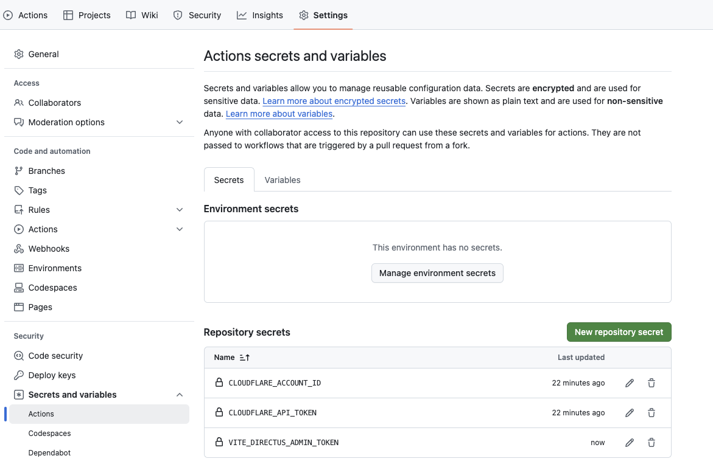
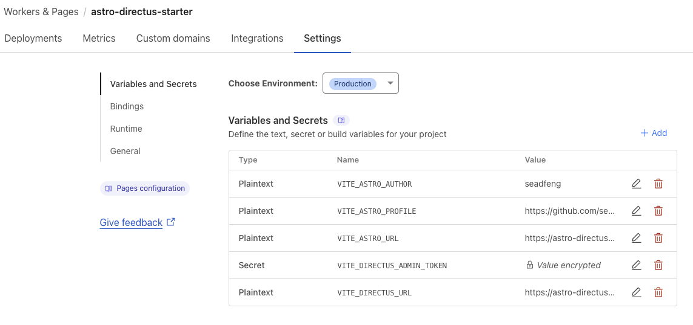

# AstroPaper With Directus

Base on [AstroPaper](https://github.com/satnaing/astro-paper)

## Dev

```bash

# Get Directus Starter for Backend
git clone https://github.com/seadfeng/headless-directus-starter.git && mv headless-directus-starter backend && mv backend/.env.example backend/.env

# Reset proxy if you need
source .bashrc

# dev
mv .env.example .env
pnpm develop

```

## Deploy

### Regenerate Directus Admin Token

Regenerate Token for Workers & Pages Variables and Secrets `VITE_DIRECTUS_ADMIN_TOKEN`


### Github Actions

#### Actions secrets and variables

**secrets**

- CLOUDFLARE_ACCOUNT_ID
- CLOUDFLARE_API_TOKEN



### Workers & Pages

### Settings > Variables and Secrets



## Dependencies

- [headless-directus-starter](https://github.com/seadfeng/headless-directus-starter.git)
